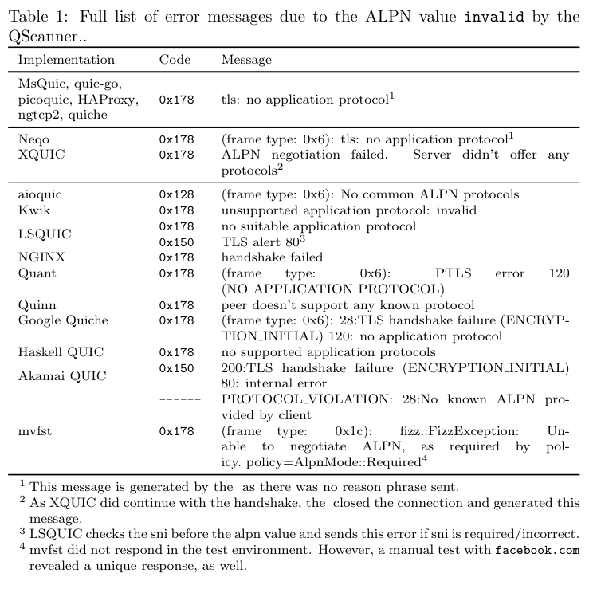
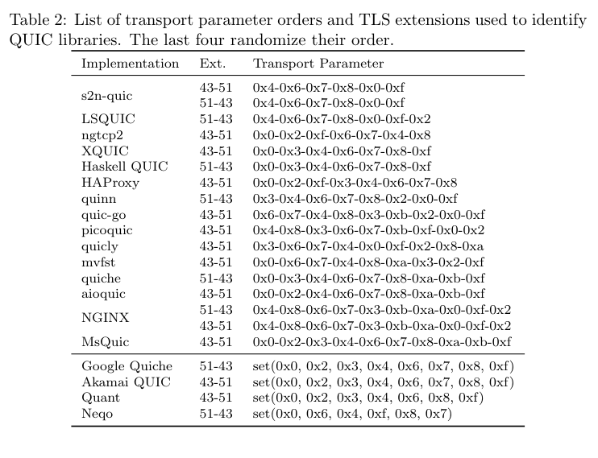

# QUIC Hunter: Finding QUIC Deployments and Identifying Server Libraries Across the Internet

This repository is based on the paper *QUIC Hunter: Finding QUIC Deployments and Identifying Server Libraries Across the Internet* published in the proceedings of the Passive and Active Measurement Conference (PAM) 2024.
For more information, we refer to the paper.

If you use material from this repository, please cite the paper:
```
@inproceedings{zirngibl2024quichunting,
  author = {Zirngibl, Johannes and Gebauer, Florian and Sattler, Patrick and Sosnowski, Markus and Carle, Georg},
  title = {{QUIC Hunter: Finding QUIC Deployments and Identifying Server Libraries Across the Internet}},
  booktitle = {Passive and Active Measurement Conference (PAM)},
  year = {2024},
  month = mar,
  month_numeric = {3}
}
```

##  Library Identification Tools
The ```identification``` directory contains scripts to identify QUIC libraries based on the [QScanner](https://github.com/tumi8/qscanner) output and the methodology described in the paper.

```classify_alpn.py``` identifies libraries based on the error message triggered by an ALPN value "invalid".
The QScanner does not allow to configure the sent ALPN value. Therefore, we updated the code and create a [dedicated binary](scanner_binaries/qscanner-alpn). To recreate the binary yourself, change [NextProtos](https://github.com/tumi8/QScanner/blob/4c2c3b24ccf5ef36deea5f24dcfe3702cf1cafea/scanning/scan.go#L55) to ```[]string{"invalid"}``` (or apply our provided [patch file](scanner_binaries/0001-send-invalid-as-alpn-value.patch) with `git apply 0001-send-invalid-as-alpn-value.patch`).



```classify_tlstp.py``` identifies libraries based on the transport parameter order. It relies on the output of the QScanner in case of successful handshakes. Therefore, the second binary relies on the normal behavior sending h3 as ALPN value and conducts an HTTP/3 get request additionally (a [binary](scanner_binaries/qscanner-h3) is also provided).
The logic to parse the QScanner output and extract the transport parameters as sent on the wire is given in `tlstp_backend.py`. If a parameter list collides between a static library and one that randomizes the order, it is marked explicitly and targets can be scanned again. More information about this is available in the paper.



```classify_merge.py``` can be used to combine the identification from the previous two approaches, check for inconsistencies and unify both identifications.

As explained in the paper, we use a different QUIC packet with ZMap to trigger the version negotiation by the server. Therefore, the result is not directly parsed. We added a python script (```zmap_classification_scale.py```) that allows to parse the ZMap output and in case of a version negotiation, extracts offered QUIC versions.

## Test Environment for QUIC Scanning
The ```testenvironment``` directory contains our local environment based on Docker and different QUIC server containers for the [QUIC Interop Runner](https://interop.seemann.io/).

It allows testing [ZMap](https://github.com/tumi8/zmap) and the [QScanner](https://github.com/tumi8/QScanner)
against common server implementations and was used to test different means to identify QUIC libraries.

It is inspired by the QUIC [Interop Test Runner](https://github.com/marten-seemann/quic-interop-runner)
and uses the Docker images (with their configuration and parameter passing) as well as the certificate
generation scripts and general ideas.

### Prerequisites
Make sure the following things are ready:
- `python3` *(Tested with: Python 3.9.2)*
- `Docker` *(Tested with: Docker version 20.10.21, build baeda1f)*
- `Docker Compose` *(Tested with: Docker Compose version v1.29.1)*
- Python module `Jinja2`

### Setup
#### Manual setup

- Generate the certificate (the number parameter is the chain length)
``` bash
cd certificate
chmod +x certs.sh
./certs.sh certs 1
cd ..
```

- Build the Docker image that will run the scanners
```bash
cd scanimage
chmod +x build.sh
./build.sh
cd ..
```

- Copy the scanner binaries you want to run to `scanners/`. The following names are expected:
    - `zmap`
    - `qscanner`
- **If the scanners are compiled on a different OS (version) than `ubuntu:22.04` they may not run inside the container!**
    - In this case, adjust the scanning OS (version) in `scanimage/Dockerfile` accordingly
```bash
cp [src] scanners/
```

- Provided [binaries](scanner_binaries) were built on Debian 11 with `Linux 5.10.0-18-amd64`

### Run a scan
All configuration is done in `config.py`:
- Enable/disable each of the three scanners
- Set parameters for the servers and scanners
- Enable/disable and add server images

If you want to adjust the commands and parameters that start the scanners, you can do so in `templates/script.sh`.

After you finished configuring your scan, simply start it with:

```bash
$ python3 run.py
```

### Output
The script will create a dedicated folder inside `results` (if not configured otherwise).

This folder includes:
- `input/` contains the input files and script used for the scans
- `misc/` contains the copied certificate, scanners, config and compose file (if enabled)
- `output/` contains a directory for each scanner with their output files and the paket capture (if enabled)
- `serverlogs/` contains a directory for each server with the logs they generated in their containers (if enabled)
- `compose_out.log` is the console output of compose and all containers (useful for debugging)
- `server_mapping.csv` is a mapping between the implementation and its IP address in the scan

### Quick statistics of the scan
For convenience, this project provides a short script to generate a statistic for a quick summary of the scan.

- These scripts additionally require the following Python modules:
    - `pandas`
    - `numpy`
    - `pyshark`

The statistics script uses the output of each scanner (and uses the classified ZMap output if available):
```
$ python3 analysis/scan_statistics.py results/scan_XXXX-XX-XX_XX-XX-XX/
```
This will create the file `statistics.txt` in the scan directory.
